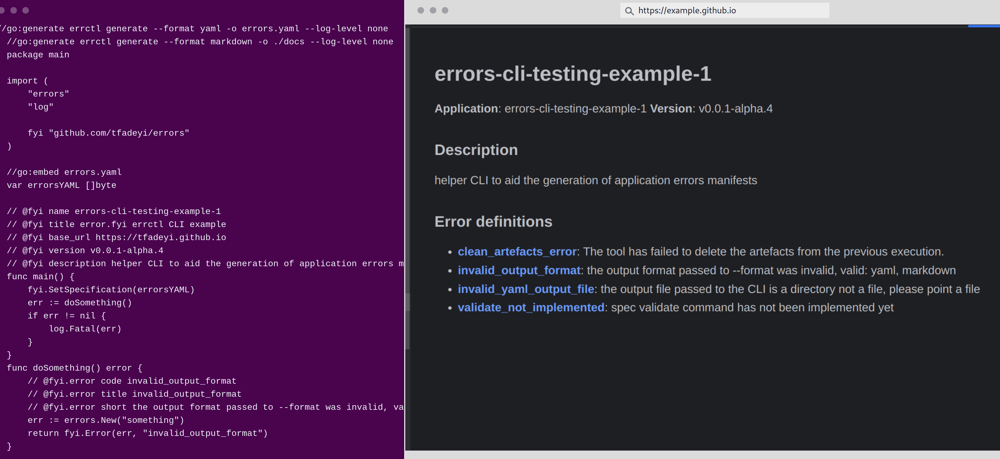

<!-- markdownlint-configure-file {
  "MD013": {
    "code_blocks": false,
    "tables": false
  },
  "MD033": false,
  "MD041": false
} -->

<a name="readme-top"></a>

<div align="center">

[](https://github.com/tfadeyi/errors/releases)
[](https://github.com/tfadeyi/errors)
[](https://github.com/tfadeyi/errors/actions/workflows/ci.yml)
[](https://github.com/tfadeyi/errors/blob/main/LICENSE)
[](https://github.com/tfadeyi/errors)
[](https://goreportcard.com/report/github.com/tfadeyi/errors)


<a href="https://github.com/tfadeyi/errors">
    
</a>

<p align="center">

<a href="https://docs.error.fyi"><strong>Explore the docs »</strong></a>

**error.fyi** is a CLI tool for generating documentation for user facing errors.
**error.fyi** is also a client library with which you can wrap your application errors with additional
context and link to the error documentation.

<a href="#-features">**Features**</a>
·
<a href="#-installation">**Installation**</a>
·
<a href="#-get-started">**Get Started**</a>
·
<a href="https://github.com/tfadeyi/errors/issues">**Report Bug**</a>


</p>

</div>

---

> **Warning**
> The project is not yet production ready.

## About The Project



**"I wish I had a stackoverflow page for the error this CLI just returned"**.

**error.fyi** was my attempt at trying to provide application developers with a convinient
way to give their users a smoother error troubleshooting experience.

## 🚀 Get Started

---

### Prerequisites

* Import the error.fyi's go library.
    
    ```sh
     go get -u github.com/tfadeyi/errors@latest
    ```

* Install the error.fyi's CLI.

    ```sh
     curl -sfL https://raw.githubusercontent.com/slosive/sloscribe/main/install.sh | sh -
    ```

## 🖥️  Usage

Create a placeholder file for your application error manifest.

```shell
touch errors.yaml # place it in the same directory as the main.go
```

Add in-code annotations for the errors the application's users might see.

```go
   package main
    
    import (
        "errors"
        "log"
    
        fyi "github.com/tfadeyi/errors"
    )

    //go:embed errors.yaml
    var errorsYAML []byte

    // @fyi name example
    // @fyi base_url https://example.github.io
    // @fyi version v0.0.1
    // @fyi description example error manifests
    func main() {
		fyi.SetSpecification(errorsYAML)
        err := doSomething()
        if err != nil {
            log.Fatal(err)
        }
    }
    func doSomething() error {
        // @fyi.error code error_something_code
        // @fyi.error title Error doing something
        // @fyi.error short There was an error while doing something.
        err := errors.New("something")
        return fyi.Error(err, "error_something_code")
    }
```

```shell
errctl generate --format yaml -o error.yaml # will generate the application error manifest
```

```shell
errctl generate --format markdown -o ./docs # will generate the error markdown docs
```

Now whenever an error is thrown the application will now add the additional context described in the in-code annotations:

```text
$ go run main.go
Error: [something]
The tool has failed to delete the artefacts from the previous execution.
for additional info check https://github.com/tfadeyi/my-app/example/error_something_code
```

<details>
<summary>CLI Generate Command</summary>

```text
Usage:
  errctl generate [flags]

Flags:
      --error-template string   
  -f, --file string             Source code file to parse
      --format string           Output format (yaml,markdown) (default "yaml")
  -h, --help                    help for generate
  -d, --include strings         Comma separated list of directories to be parses by the tool (default [/home/oluwole/go/src/github.com/tfadeyi/errors/cmd])
      --info-template string    
  -l, --language string         Target source code language (default "go")
  -o, --output string           Target output file or directory to store the generated output

Global Flags:
      --log-level string   Only log messages with the given severity or above. One of: [none, debug, info, warn], errors will always be printed (default "info")
```

</details>

<p align="right">(<a href="#readme-top">back to top</a>)</p>

## 📚 Features

- Easy to embed in existing Go applications with **go:generate** and **embed**.
- Generate markdown error documentation, with both **default** and **custom** markdown templates.
- Simple integration with static page generators.
- Simple **library** interface for an easy adoption.
- Error **embedded auto-generated URL** linking to error documentation.

<p align="right">(<a href="#readme-top">back to top</a>)</p>

## 🔽 Installation

### CLI

<details>
<summary>Linux</summary>

> The recommended way to install error.fyi CLI (errctl) is via the installation script:

> ```sh
> curl -sfL https://raw.githubusercontent.com/slosive/sloscribe/main/install.sh | sh -
> ```

</details>

<details>
<summary>MacOS</summary>

> The recommended way to install error.fyi CLI (errctl) is via the installation script:

> ```sh
> curl -sfL https://raw.githubusercontent.com/slosive/sloscribe/main/install.sh | sh -
> ```

</details>

<p align="right">(<a href="#readme-top">back to top</a>)</p>

## Try it with Nix!

```shell
nix develop github:tfadeyi/errors
```

<p align="right">(<a href="#readme-top">back to top</a>)</p>

## License
error.fyi is released under the [MIT](./LICENSE) License.

<p align="right">(<a href="#readme-top">back to top</a>)</p>
